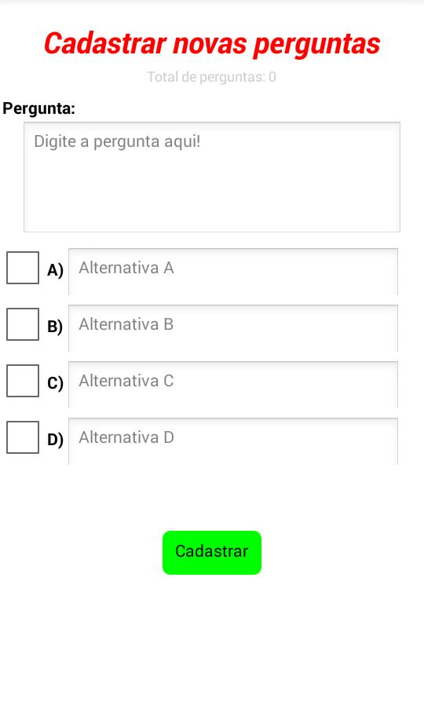
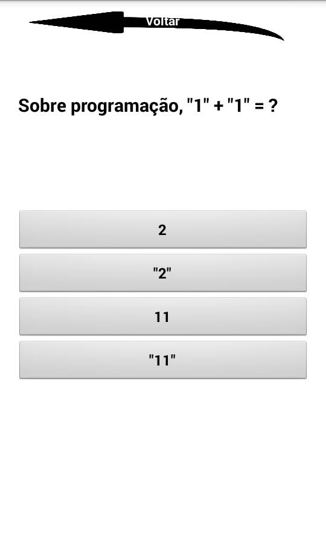

<!DOCTYPE html>
<h1>Aplicativo para criação de quizzes personalizados <h1/>
  

Aplicativo criado usando o MIT App Inventor. Feito para a criação de quizzes personalizados.

O usuário pode cadastrar quaisquer perguntas que desejar e criar seu próprio quiz, todas as perguntas ficarão salvas em um banco de dados, nunca são perdidas.

A tela de cadasto de perguntas é aonde o jogador pode cadastrar suas novas perguntas e pode visualizar o total de perguntas cadastradas. Para cadastrar uma nova pergunta basta o usuário preencher todos os campos como especificado e selecionar qual é a resposta correta (na caixa de seleção)

<h6> Tela de cadastro <h6/>

A tela de jogo mostra as perguntas na ordem que foram cadastradas, se o jogador acertar a pergunta avança para a próxima se errar volta ao começo do jogo. Quando chegar na ultima pergunta, ao respondê-la corretamente, o jogador tem a opção de voltar a tela inicial ou recomeçar o quiz

<h6> Tela de jogo <h6/>

